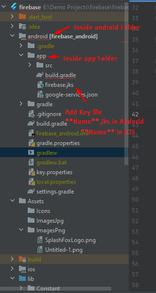
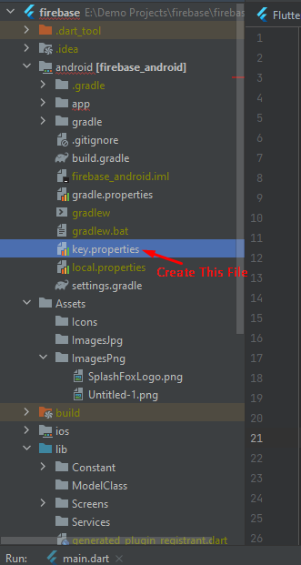

# How to SetUp-KeyStore In FLutter
+ Step : 1 -- Add KeyStore Key File Inside -> `yourProject` -> `android` -> `app` 

Note : If keystore Generated from android side it's name is **Name**.jks and if KeyStore Generated From IOS There is No extention **.jks**

### Example Image


+ Step : 2 -- Create File `key.properties` Inside -> `yourProject` -> `android` Folder.

### Example Image


+ Step : 3 -- Paste This Code inside in `key.properties` File.
**Note** : Use Your keyStore password Alias And Name **same**.

```dart
storePassword = firebase
keyPassword = firebase
keyAlias = firebase
storeFile = firebase.jks
```

+ Step : 4 --  Paste Code In side [YourProject] --> android --> app --> build.gradle File

**Note** : Paste This Code above android Function

```dart
def keystoreProperties = new Properties()
def keystorePropertiesFile = rootProject.file('key.properties')
if (keystorePropertiesFile.exists()) {
    keystoreProperties.load(new FileInputStream(keystorePropertiesFile))
}


android {
   .....
    }
```

+ Step : 5 -- Now Paste This code in same file.

```dart
# Instead Of This :

           buildTypes {
        release {
            // TODO: Add your own signing config for the release build.
            // Signing with the debug keys for now, so `flutter run --release` works.
            signingConfig signingConfigs.debug
        }
    }

# Put This Code :

  signingConfigs {
       release {
           keyAlias keystoreProperties['keyAlias']
           keyPassword keystoreProperties['keyPassword']
           storeFile keystoreProperties['storeFile'] ? file(keystoreProperties['storeFile']) : null
           storePassword keystoreProperties['storePassword']
       }
   }
   buildTypes {
       release {
           signingConfig signingConfigs.release
       }
```

# How to get `SHA1` and `SHA256` from your KeyStore

+ Step : 1  Open **cmd** write `cd` then paste your JDK Path For Example `C:\Program Files\Java\jdk-11.0.14`
+ Step : 2 Now Paste  **keytool -list -v -keystore "[Here Set Your Key Store Path] Example :- F:\KeyStore\Firebase\firebase.jks" -alias [AliasName] -storepass [Password] -keypass [KeyPassword]**
+ Step : 3 Press Enter.

# How to Get Your Pc `SHA1` And `SHA256`
+ Step : 1 InSide `[YourProject]` -> `android` -> `gradlew` Right Click On `gradlew` file now open in terminal
+ Step : 2 Now Paste `./gradlew signingReport` 
+ Step : 3 Press Enter.
